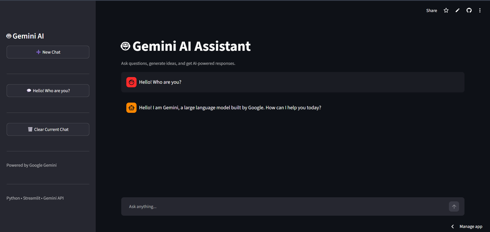

# 🤖 Gemini AI Chatbot

An AI-powered chatbot built with **Python**, **Streamlit**, and the **Google Gemini API**. The chatbot supports multiple conversations, remembers chat history within each session, and provides a clean and interactive interface.

---

## 🚀 Live Demo

🔗 **Live App:** *https://gemini-ai-chatbot-3gze5uwsrmso3mq97j4zkq.streamlit.app/*

---

## 📸 Screenshot

> Add your screenshot here after uploading it to GitHub.



---

## ✨ Features

- 🤖 AI-powered chatbot using Google Gemini API
- 💬 Multiple chat support
- 📝 Automatic chat titles
- 🔄 Switch between previous conversations
- 🗑️ Clear current chat
- ⚡ Fast and responsive Streamlit interface
- 🔒 Secure API key management using environment variables

---

## 🛠️ Tech Stack

- Python
- Streamlit
- Google Gemini API
- python-dotenv
- Git & GitHub

---

## 📂 Project Structure

```
Gemini-AI-Chatbot/
│
├── app.py
├── requirements.txt
├── README.md
├── .gitignore
└── .env
```

---

## ⚙️ Installation

Clone the repository:

```bash
git clone https://github.com/shamilba/Gemini-AI-Chatbot.git
```

Go to the project folder:

```bash
cd Gemini-AI-Chatbot
```

Install dependencies:

```bash
pip install -r requirements.txt
```

Create a `.env` file:

```text
GOOGLE_API_KEY=your_api_key_here
```

Run the application:

```bash
streamlit run app.py
```

---

## 👨‍💻 Author

**Shamil B A**

GitHub: https://github.com/shamilba